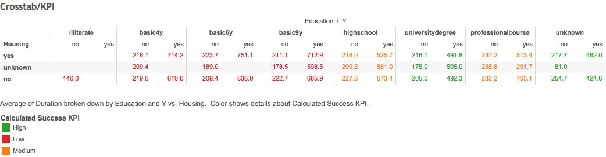
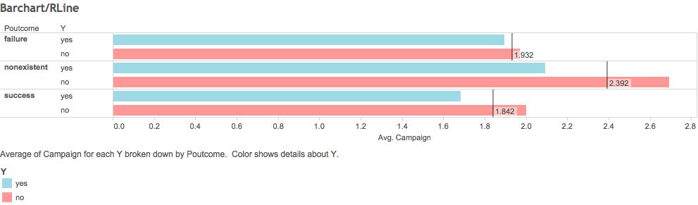

**Authors: Rolando Melendez, Hyunji Seo, Catherine Tu**

##This is how our RStudio is configured:
```{r}
sessionInfo()
```
***
##Program file structure
  00 Doc - contains .Rmd and .html 
  
  01 Data - contains the code to Extract, Transform, and Load our data 
  
  02 Tableau - this is where the Tableau workbook goes, make it a twb file 
  
  #03 R SQL Visualizations - contains our workflows and the code for the visualizations #Not used in project

***  
##Data summary and subset
```{r}
#Shows the subset and summary of the data frame
#source("../01 Data/R_ExtractTransform.R", echo = TRUE)
#source("../01 Data/R_Load.R", echo = TRUE)
```

####Explanation of Data:
This data relates to the direct marketing campaign of a Portuguese bank to have people subscribe to a term deposit at their institution. The campaign had gathered data regard their campaign efforts, individuals' demographics, and external social situations at the time of the campaign. 

##Scatter Plot
```{r}
#Shows the subset and summary of the data frame
#source("../03 R SQL Visualizations/ScatterPlot.R", echo = TRUE)
```


####Findings:
In this visualization we observed Consumer Price Index (CONS.PRICE.IDX), duration of the last marketing call (DURATION), and final outcome of the campiagn (Y).

We found that for those who said yes there seemed to be a longer call duration and higher consumer price index for the period they were contacted. We speculate this is due to the fact that when consumer price index rises so do interest rates, and that would make people less likely to subscribe to a term deposit. Therefore, in order to get a yes, a longer call was required. 

***

##Cross Tab and KPI
```{r}
#Shows the subset and summary of the data frame
#source("../03 R SQL Visualizations/Crosstab_KPI.R", echo = TRUE)
```


####Findings:

***

##Bar Chart and Reference Line
```{r}
#Shows the subset and summary of the data frame
#source("../03 R SQL Visualizations/Barchart_RLine.R", echo = TRUE)
```


####Findings:
In this visualization we observed the number of times each person was contacted in the current cmpaign (CAMPAIGN), past campaign outcome (POUTCOME), and current campaign outcome (Y)

Overall, we found that banks, on average, spent more effort on people who have not been contacted in previous campaigns. For those who have previously been a customer, banks required less contact times on average compared to the other two groups. This leaves previous non-customers who were contacted, on average, higher than previous customers, but lower than new targets. Lastly, one consistent trend was that across all groups the average effort needed to persuade those who ultimately said yes was less than those who refused. 

***
